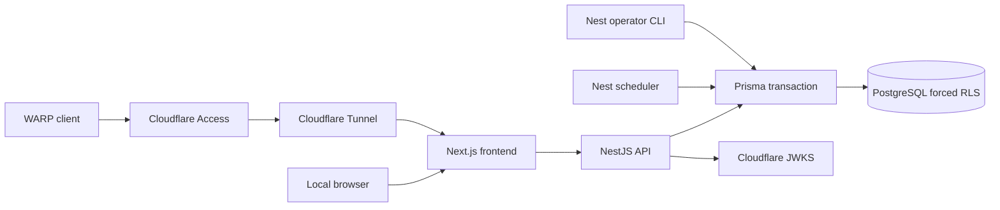

# Architecture and data flow

[ADR 0008](../../docs/adr/0008-split-presentation-and-business-services.md) owns the current topology. Local/private constraints from ADR 0005/0007 still apply; [CONTEXT.md](../../CONTEXT.md) owns vocabulary.

## Trust boundaries

QAS Tunnel/Next share `edge`; Next/Nest share internal `app`; Nest/PostgreSQL share internal `data`. Nest also joins `api-egress` for JWKS. QAS publishes no host ports. Next has no DB credentials or data-network membership. Exact settings belong to [Compose](../../infra/compose.yaml).

Local has a separate volume/network and loopback services. Opaque cookie login may create a development identity from email/Thai mobile. QAS requires a verified Access JWT with an invited active email; plain identity headers do not authenticate. Local profile contacts can change through controlled identity operations; QAS contacts are read-only. Production mode is fail-closed until separately implemented.

## Request flow

1. Browser sends a same-origin request; Next proxies relevant headers/cookie to Nest.
2. Nest validates input and verifies session/JWT.
3. A transaction resolves User identity, applies restricted role/RLS, locks the User and revalidates identity.
4. Catch-up advances calendar state; the use case checks revision/rules and writes/derives through the same client.
5. Nest returns the common JSON envelope; Next forwards it and UI renders the view/capabilities.

The detailed transaction contract lives in [database standards](../standards/backend/database.md). GET requests may trigger catch-up; do not assume reads always leave calendar state untouched. Authenticated calendar reads and local clock changes deliberately skip financial catch-up.

In local only, authenticated operations and each scheduler owner transaction enter the shared in-memory calendar gate before taking DB/owner locks. The effective date and admitted clock revision remain fixed through transaction retries. Clock changes authenticate in a transaction, then update process state after commit while still holding the gate. Next forwards the rendered form's `x-deledger-clock-revision`; an explicit stale token fails before financial catch-up. QAS has no simulated clock and production remains startup-rejected. See [ADR 0009](../../docs/adr/0009-separate-clock-simulation-from-tracking-restarts.md) and the [local testing guide](../guides_flows/development.md#test-accounting-dates-locally).

Stored inputs/confirmation facts are authoritative. `month-view.ts` derives views; `catch-up.ts` and `month-write.ts` manage continuity/corrections. Setup is copied once into a month; confirmation preserves its own facts. Archive across a boundary creates a Tracking Gap, not invented zero-activity months.

There is no message broker, Authentik, bank feed or notification pipeline. Adding integrations that affect retries, identity or money needs explicit design and impact assessment.
